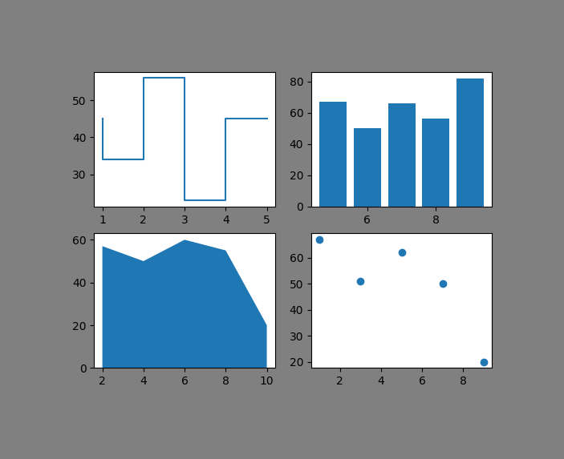

# 📊 Matplotlib Exercise

A hands-on collection of Jupyter Notebooks covering the most essential chart types in **Matplotlib** — from basic plots to real-world data visualizations using Excel datasets.



---

## 📁 Project Structure
```
Matplotlib-Exercise/
│
├── Bar Plot.ipynb
├── Box Plot.ipynb
├── Histogram.ipynb
├── Legends.ipynb
├── Line Plot.ipynb
├── Pie Chart.ipynb
├── Scatter Plot.ipynb
├── Stack Plot.ipynb
├── Stem Plot.ipynb
├── Step Plot.ipynb
├── Sub PLot.ipynb
├── Violin Plot.ipynb
├── Save.ipynb
├── ESD.xlsx
└── expense3.xlsx
```

---

## 📌 Topics Covered

| Notebook | Description |
|---|---|
| `Bar Plot.ipynb` | Vertical & horizontal bar charts with custom colors and real expense data |
| `Box Plot.ipynb` | Single and multiple box plots for distribution analysis |
| `Histogram.ipynb` | Frequency distributions with custom bins and real age data |
| `Legends.ipynb` | Adding and styling legends for multi-line plots |
| `Line Plot.ipynb` | Single & multi-line plots with real-world date/amount data |
| `Pie Chart.ipynb` | Brand market share and expense breakdown as pie charts |
| `Scatter Plot.ipynb` | Scatter plots using random and real employee data |
| `Stack Plot.ipynb` | Stacked area charts for weekly trend comparison |
| `Stem Plot.ipynb` | Stem plots with custom markers, orientation, and baseline |
| `Step Plot.ipynb` | Step charts for categorical payment mode comparisons |
| `Sub PLot.ipynb` | Creating multi-panel subplot layouts |
| `Violin Plot.ipynb` | Distribution plots with median lines on real age data |
| `Save.ipynb` | Saving plots as image files (PNG, PDF, etc.) |

---

## 🗂️ Datasets

- **`expense3.xlsx`** — Personal expense data with Date, Amount, and Payment Mode columns
- **`ESD.xlsx`** — Employee dataset with fields like Age and Employee ID

---

## 🛠️ Requirements
```bash
pip install matplotlib pandas numpy openpyxl
```

---

## 🚀 Getting Started

1. **Clone the repository**
```bash
   git clone https://github.com/your-username/Matplotlib-Exercise.git
   cd Matplotlib-Exercise
```

2. **Install dependencies**
```bash
   pip install matplotlib pandas numpy openpyxl
```

3. **Launch Jupyter Notebook**
```bash
   jupyter notebook
```

4. Open any `.ipynb` file and run the cells!

---

## 🧰 Tech Stack


---

## 📄 License

This project is open source and available under the [MIT License](LICENSE).
